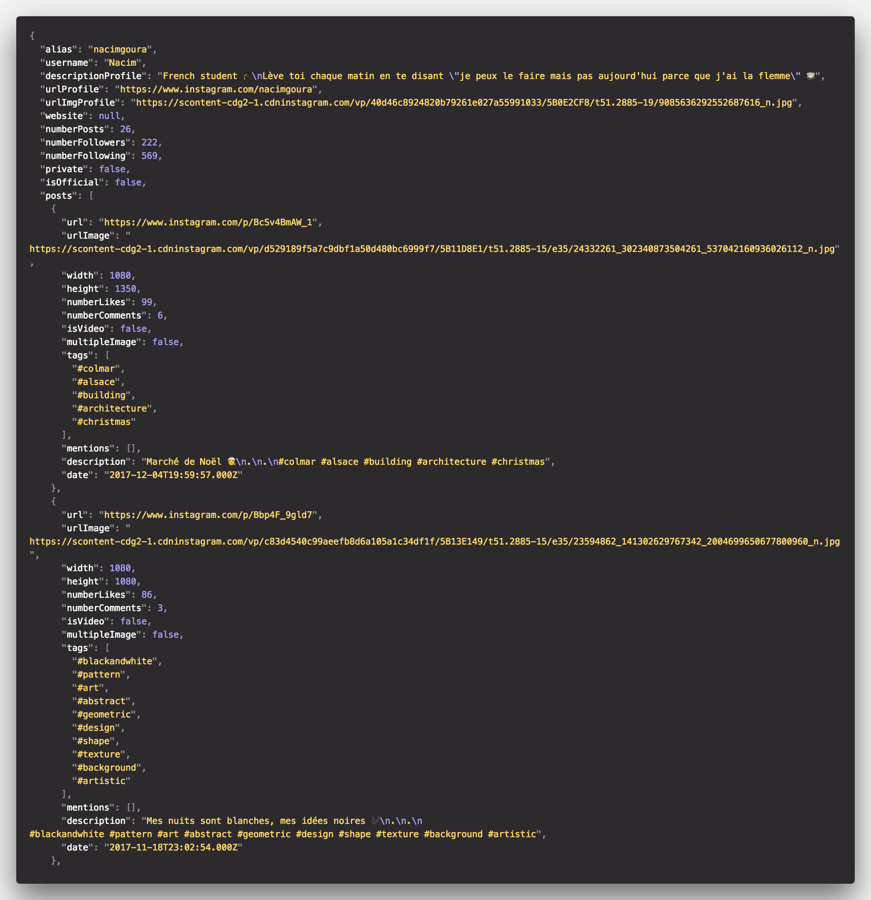

# instagram-profilecrawl

<h1 align="center">
	
</h1>

[](https://www.npmjs.com/package/instagram-profilecrawl)
[](https://travis-ci.org/nacimgoura/instagram-profilecrawl)
[](https://www.nodejs.org/)
[](https://github.com/GoogleChrome/puppeteer)
[](https://david-dm.org/nacimgoura/instagram-profilecrawl)

> Quickly crawl the information (e.g. followers, tags, mentions, date, etc...) of an instagram profile. No login required!

## Install

```bash
npm install instagram-profilecrawl -g
```

This module needs Node.js 7.6 or later.

## Usage

```bash
$ instagram-profilecrawl --help

  Usage
    $ instagram-profilecrawl <name>

  Options
    --output -o          define output format (JSON, YAML)
    --limit -l           get only the number of post defined by the limit
    --interactive -i     disable headless mode

  Examples
    $ instagram-profilecrawl nacimgoura
    $ instagram-profilecrawl nacimgoura -o yaml
```

## Example

You can find complete examples in the example folder.



## License

MIT © [Nacim Goura](https://nacimgoura.github.io)
